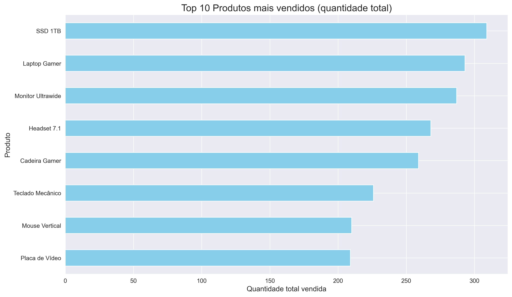
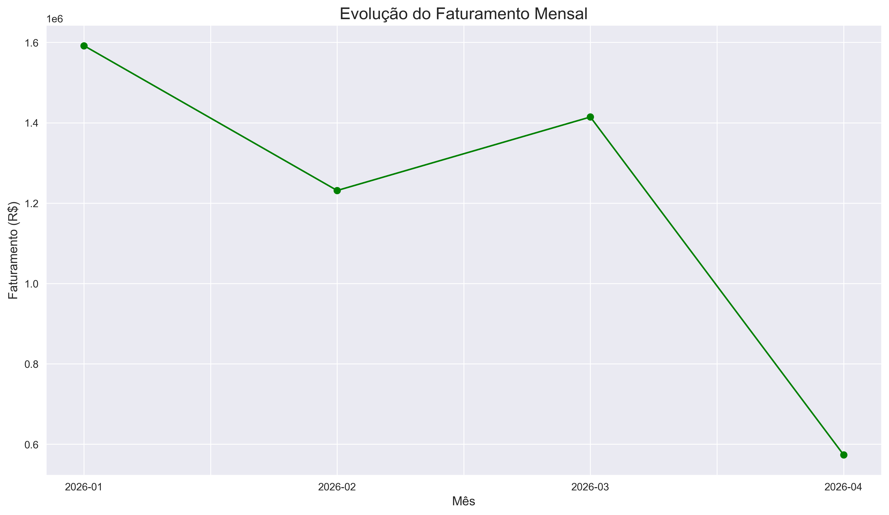
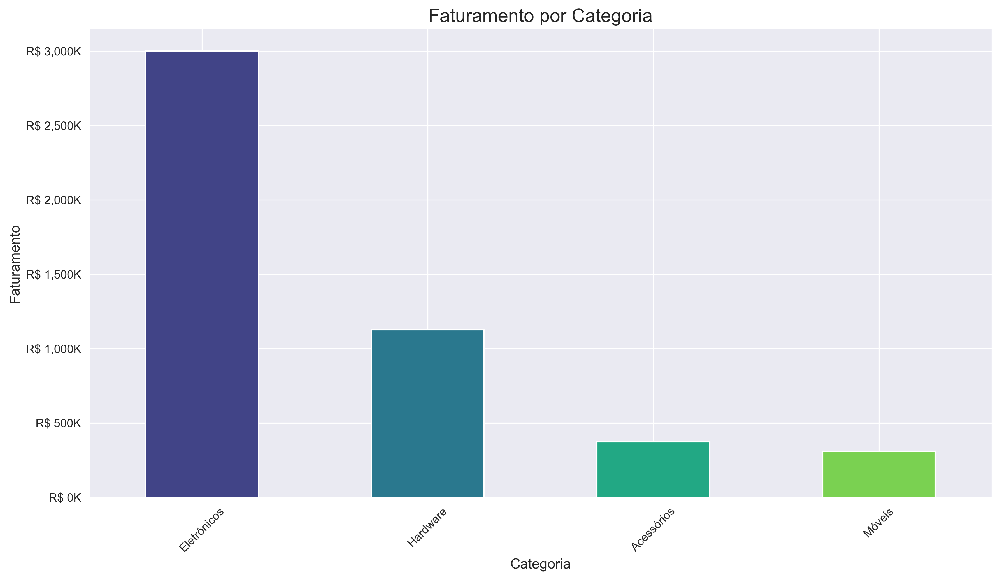
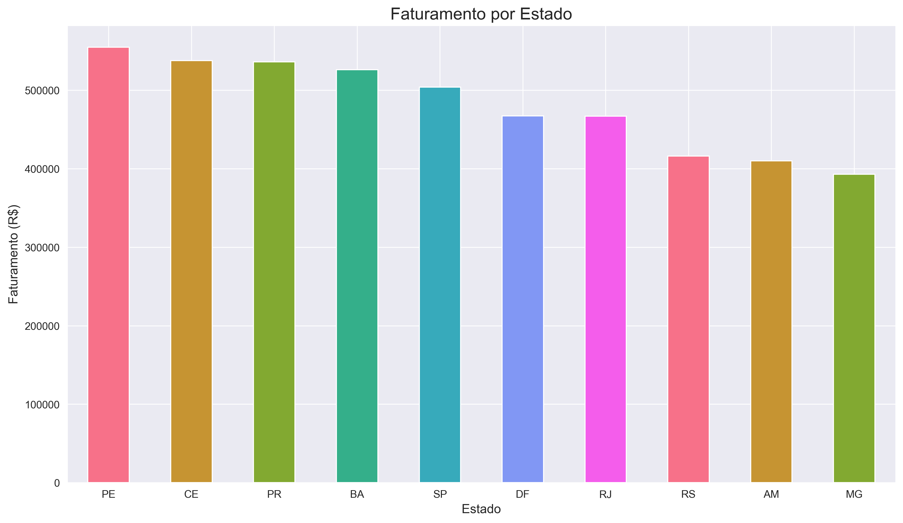

# 📊 Análise de Vendas para E-commerce

Projeto desenvolvido em Python para simular um cenário de vendas de um e-commerce, aplicando conceitos de geração de dados, manipulação de dados com Pandas e visualização utilizando Matplotlib e Seaborn.

Este projeto faz parte da minha jornada de estudos em Python e Ciência de Dados, tendo como objetivo consolidar boas práticas de programação, organização de projetos e análise exploratória de dados (EDA).

---

# Demonstração

O projeto gera automaticamente um conjunto de dados fictício contendo centenas de vendas e produz análises estatísticas acompanhadas de gráficos.

## Top 10 Produtos Mais Vendidos



---

## Faturamento Mensal



---

## Faturamento por Categoria



---

## Faturamento por Estado



---

# Funcionalidades

- Geração de dados fictícios de vendas
- Criação automática do DataFrame
- Engenharia de atributos
- Cálculo do faturamento por venda
- Classificação do status de entrega
- Estatísticas descritivas
- Ranking dos produtos mais vendidos
- Faturamento por categoria
- Faturamento por estado
- Evolução do faturamento mensal
- Geração automática de gráficos

---

# Tecnologias Utilizadas

- Python
- Pandas
- NumPy
- Matplotlib
- Seaborn

---

# Estrutura do Projeto

```
Analise-De-Vendas-Para-Ecommerce
│
├── charts.py              # Funções responsáveis pelos gráficos
├── config.py              # Constantes e configurações
├── data_generator.py      # Geração dos dados fictícios
├── utils.py               # Funções auxiliares
├── main.py                # Execução principal
│
├── images/                # Gráficos gerados
│
├── requirements.txt
└── README.md
```

---

# Como Executar

Clone o repositório

```bash
git clone https://github.com/JoaoVitorDC25/Analise-De-Vendas-Para-Ecommerce.git
```

Entre na pasta

```bash
cd Analise-De-Vendas-Para-Ecommerce
```

Instale as dependências

```bash
pip install -r requirements.txt
```

Execute o projeto

```bash
python main.py
```

---

# Dependências

```text
pandas
numpy
matplotlib
seaborn
```

---

# Conceitos Aplicados

Durante o desenvolvimento foram praticados conceitos como:

- Organização de projetos Python
- Modularização do código
- Separação de responsabilidades
- Manipulação de DataFrames
- Agrupamentos (`groupby`)
- Engenharia de atributos
- Estatísticas descritivas
- Visualização de dados
- Geração de gráficos
- Reutilização de código
- Utilização de funções auxiliares

---

# Próximas Melhorias

O projeto continuará evoluindo conforme avanço nos estudos de Ciência de Dados.

Algumas melhorias planejadas:

- Exportação dos dados para CSV
- Dashboard interativo com Streamlit
- Geração automática de relatórios
- Indicadores de Ticket Médio
- Análise por período
- Filtros dinâmicos
- Heatmaps
- Boxplots
- Histogramas
- Tratamento de dados ausentes
- Testes automatizados

---

# Objetivo

Este projeto foi desenvolvido com foco em aprendizado e composição de portfólio, demonstrando conhecimentos em Python para análise de dados e visualização de informações.

---

# Autor

**João Vitor Dias**

Técnico em Eletrônica • Estudante de Análise e Desenvolvimento de Sistemas

GitHub:

https://github.com/JoaoVitorDC25